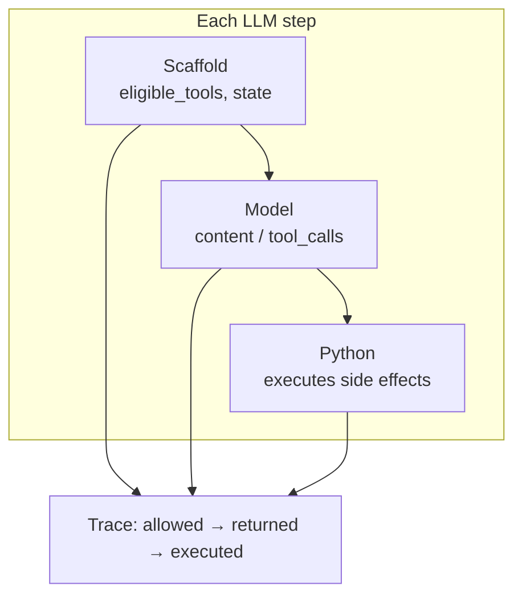
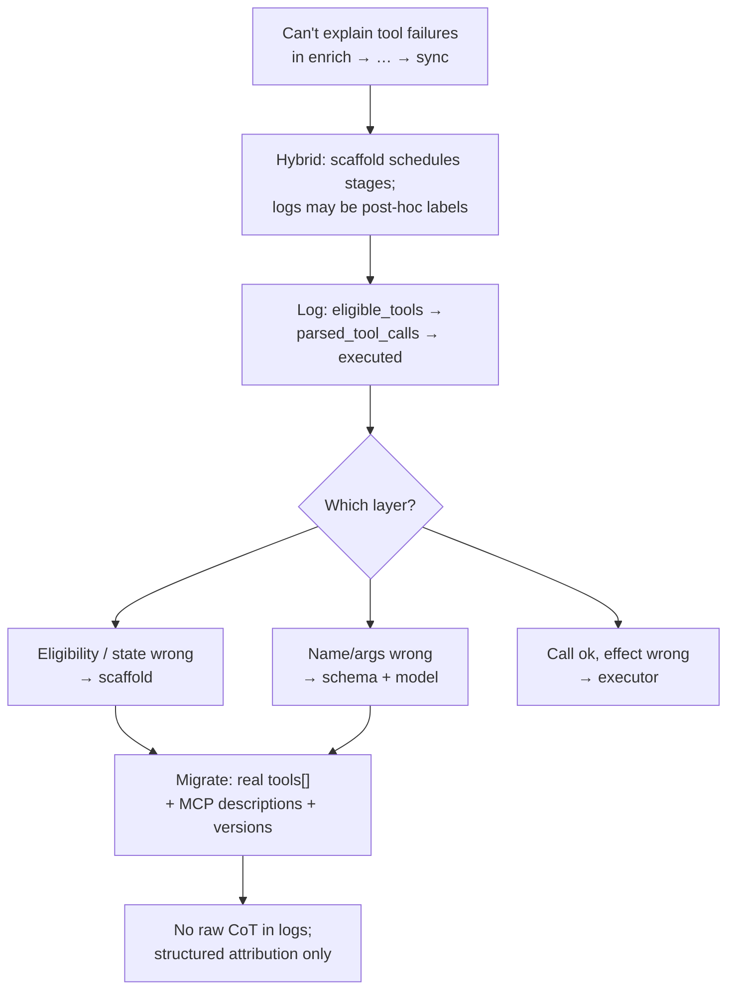

# Asker's Question

# Question: tool attribution — model vs MCP descriptions vs scaffold

My Week 10 project has a working agent path and trace layer, but I still cannot cleanly explain *why* the model chose a tool at a given turn or *where* a multi-turn tool-use failure came from. In `agent/orchestration/pipeline.py` and `artifacts/traces/agent_trace_log.jsonl`, I can observe tool outcomes across `enrich → compose → qualify → book → sync`, but I cannot reliably separate **model tool-choice behavior** from **tool-description quality**, **MCP exposure**, or **scaffold policy**.

**Research question:** In my Tenacious workflow, how can I design **MCP tool descriptions**, **function-calling traces**, and **multi-turn orchestration** so I can distinguish: **(1)** model-level tool choice, **(2)** tool-selection effects caused by tool schema or description quality, and **(3)** scaffold-driven planning behavior across turns — without treating hidden reasoning tokens as part of the answer or logging unsafe internal reasoning?

---

# My Answer: Layer Attribution for Hybrid Agents (Scaffold-First, Tool-Ready Traces)

> **Who this is for:** Engineers shipping **sequential conversion pipelines** (enrich → compose → … → sync) where traces list `tool_calls` but the runtime is **mostly code-scheduled**, with **LLM substeps** (e.g. compose) and a path toward **real function calling / MCP**. Written for **Gersum Asfaw**; explainer **Hiwot Beyene**.

---

## Core concepts: “tool choice” means different things in scaffold-first systems

**Full tool-calling agent:** The model’s completion can include **structured `tool_calls`** (name + arguments) from an advertised **`tools[]`** list. The host executes them and may return **tool result** messages before the final assistant reply.

**Gersum’s stack today (hybrid):** Stages run in **`run_for_prospect` order** (briefs → compose → send → reply → qualify → book → sync). Many logged `tool_calls` entries are **post-hoc labels** (“we ran enrichment,” “we composed”) — **not** parsed provider-native function calls. The model did not rank every funnel action in one completion.

So debugging “wrong tool” without layer tags collapses three different failure modes:

| Layer | Typical failure | Fix lever |
|--------|-----------------|-----------|
| **Scaffold** | Wrong stage order, missing context, eligibility, overrides | State machine, preconditions, what each LLM call sees |
| **Tool / prompt surface** | Ambiguous names, weak descriptions, loose JSON Schema | `tools[]` copy, enums, validation errors, examples |
| **Model** | Bad output given good constraints | Model, temperature, structured decoding |

**Takeaway:** If `eligible_tools` is empty and the API never returned `tool_calls`, “wrong tool” in a post-mortem should mean **scaffold/path**, not “the model picked the wrong function.”

---

## Why “model chose a tool” is often the wrong diagnosis today

In **`compose_initial_outreach`**, a weak or mis-grounded draft is usually **(2) prompt/surface** or **(3) scaffold** (what briefs were injected, what was gated) until you log **eligible actions**, **model input fingerprints** (hash/redacted), and **parsed outputs**. Treating it as pure **(1) model** error leads to blind prompt churn.

**Rule of thumb:** Literal **model tool choice** exists only where the provider returns **`tool_calls`** and you logged them **before** Python rewrote the plan.

---

## How to design traces that make attribution mechanical

Every LLM invocation should emit a **decision record** (shared `trace_id` / `step_seq`), not only “stage completed”:

| Field | Purpose |
|--------|---------|
| `stage` | e.g. `compose_initial_outreach` |
| `scaffold_context` | Compact flags: briefs validated, reply received, stage version hash |
| `llm_call` | Model id; `chat` vs `chat+tools`; **were tools offered?** + registry hash |
| `eligible_tools` | Names + schema version, or `[]` + `"scaffold-only"` |
| `model_output_kind` | `text` \| `tool_calls` \| `mixed` |
| `parsed_tool_calls` | Raw provider payload when present |
| `scaffold_overrides` | `none` \| `blocked` \| `retried` \| `replaced_with` + reason |
| `executed_side_effects` | Send email, HubSpot sync, etc. (keep this — it is already a strength) |

**Attribution flow:** wrong `eligible_tools` → **scaffold**; right eligibility but wrong name/args → **schema + model**; right call but bad side effect → **executor / idempotency**.

---

## MCP tool descriptions (when you project real tools to the model)

MCP is **host ↔ server**; the model only sees what you **put in the request**. Good tool defs:

- **One job per tool** — no overlapping names (`sync_crm` vs `update_hubspot_contact`).
- **Description** — one paragraph: **when to use**, **when not to**, what it returns; no marketing tone.
- **JSON Schema** — strict types, enums, structured **validation errors** on failure so the model can recover.
- **`tool_registry_version`** — bump when copy changes; log on every trace for reproducibility.

---

## Multi-turn orchestration without entangling layers

“Multi-turn” here is **multiple LLM steps across lead state**, not only one chat thread with a tool loop.

**Pattern:** Finite lead state (`NEW → CONTACTED → REPLIED → …`); each transition declares **which LLM entrypoints are legal**. Pass **summaries** of CRM/booking state into the model — not raw dumps — and ensure the trace shows **whether the scaffold transition was correct** before blaming tool routing.

---

## Hidden reasoning vs what to log

Gersum’s stack uses **standard assistant content** for this workflow — no separate reasoning channel to persist. **Practice:**

- Log **decisions, structured outputs, tool args** (redact PII).
- Log **hashes** for prompts/registry, not full prompts in production.
- Do **not** store raw chain-of-thought or provider “thinking” blobs in durable traces unless compliance defines a **short, redacted rationale** format.

---

## Minimum next step for `compose_initial_outreach` (before a full MCP rewrite)

1. Log **brief gate** outcomes and **which brief content** (or hashes) entered the compose prompt.  
2. Log **compose prompt/schema version**.  
3. Log **model output** validation result (or hash + length).

Then classify: brief missing → **scaffold**; brief present but ignored → **model** or **instruction**; conflicting brand rules → **prompt surface**.

---

## Migration: post-hoc labels → real function-calling

1. **Phase 0 — Honest traces:** Label scaffold-only steps; stop implying model tool choice where there is none.  
2. **Phase 1 — Pilot:** One stage gets real **`tools[]`** + **tool result** messages; log `eligible_tools` + `parsed_tool_calls`.  
3. **Phase 2 — Expand** only where branching is genuinely model-dependent; keep **deterministic CRM** in Python if policy requires it.

Benchmark traces (`tenacious-bench`) benefit from the **same fields** so failures are reproducible by **registry + state + model**, not vibes.

---

## Summary

**One-line answer:** In a **scaffold-first** pipeline, most `tool_calls` rows are **execution summaries**, not model-emitted routing — so you separate **(1) model**, **(2) tool schema**, and **(3) scaffold** by logging **what was allowed**, **what the model returned** (`tool_calls` or text), and **what Python ran**, versioning tool copy, and **never** treating hidden reasoning as the auditable answer.

---

## Sources

* OpenAI. **Function calling** (Tools in Chat Completions). [https://platform.openai.com/docs/guides/function-calling](https://platform.openai.com/docs/guides/function-calling)

* Model Context Protocol. **Specification** (tools & capabilities). [https://spec.modelcontextprotocol.io/specification/](https://spec.modelcontextprotocol.io/specification/)

* Anthropic. **Tool use** (Messages API). [https://docs.anthropic.com/en/docs/build-with-claude/tool-use](https://docs.anthropic.com/en/docs/build-with-claude/tool-use)
